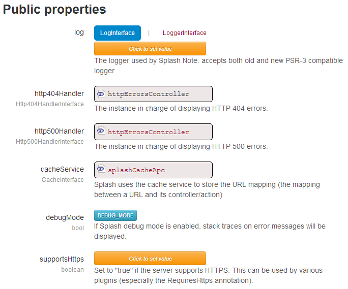

URL routing
=============================

Since version 5.0, Splash has implemented a routing system based on [stackphp's](http://stackphp.com/) recommendations around the [HttpKernelInterface](https://github.com/symfony/symfony/blob/master/src/Symfony/Component/HttpKernel/HttpKernelInterface.php).

The basics
---------------------

Splash now has a "router stack". Splash will give the Request to the first router that will handle it.
Eventually, the first router will foward it to the next one (the "fallback router"). The second router will maybe
forward the request to the third router, and so on...

**Note:** Some routers can, in fact, be considered as filters.

Splash's default router stack implementation
-------------------
Here is the Splash instance view after installation :



If you look closer at the stack, here is what you will find out :

```php
ExceptionRouter // Surround the router stack with a try/catch statement, and handle Exceptions display
  |
  PhpVarsCheckRouter // Checks if max_input_vars and max_post_size have not been exeeded
    |
    SplashDefaultRouter // Main router (will find a matching Route (controller / actions), and return the HTML
      |
      NotFoundRouter // No router has been able to handle teh Request, return a 404 response
```

The Exception router should always be the fist one as it surrounds the underlying router stack calls for catching exceptions
The PhpVarsCheck router sould be placed at the begining of the stack, and at least before the "effective" routers
The NotFoundRouter sould always be the last one.

Adding your own router into the stack
------------------
To do so, you just need to create an instance that extends the HttpKernelInterface, and put the router where you want to.

There are many existing routers that you can use and add to the stack. There is a list [on Stackphp's website](http://stackphp.com/middlewares/).
